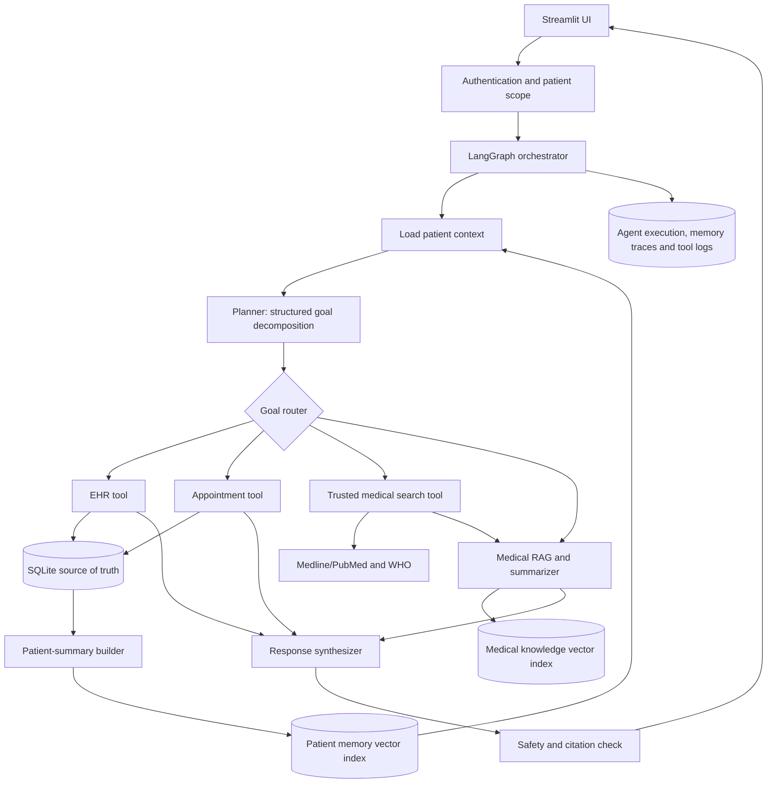

# Agentic Healthcare Assistant - Solution Design

## 1. Design objective

Implement the BRD workflow as a controlled agentic system that can:

1. interpret a multi-intent patient request;
2. retrieve authorized patient context;
3. decompose the request into ordered, typed sub-goals;
4. call only the tools allowed for each sub-goal;
5. require explicit booking intent before booking or changing clinical data;
6. retrieve current medical information from trusted sources;
7. synthesize one answer with appointment status, medical information, and citations;
8. retain a privacy-safe summary for future conversations.

This is an administrative and informational assistant, not a diagnostic or emergency-care system.

## 2. Logical architecture



## 3. Data ownership

| Data | System of record | Vector indexed? | Notes |
|---|---|---:|---|
| Patient demographics | SQLite `patients` | No | Retrieved by exact patient ID |
| Diagnoses and treatment history | SQLite `medical_history` | Summary only | Never treat vector results as canonical records |
| Prescriptions | SQLite `prescriptions` | Summary only | Include active medication context where authorized |
| Doctors and appointments | SQLite `doctors`, `appointments` | No | Transactional queries require exact filters |
| Patient longitudinal summary | Derived from SQLite | Yes, patient-scoped | Rebuild after relevant EHR changes |
| Medical literature | External trusted sources/local corpus | Yes | Separate collection/index from patient memory |
| Conversation state | LangGraph state/checkpointer | Selectively | Do not persist raw sensitive conversation by default |
| Tool and agent events | SQLite `agent_events` | No | Store inputs in redacted form |

Use separate vector collections (or separate FAISS indexes) for `patient_memory` and `medical_knowledge`. Every patient-memory item must include `patient_id`, `summary_version`, `source_updated_at`, and `content_type` metadata, and retrieval must always filter by the authenticated patient ID.

## 4. Runtime flow

### 4.1 Request intake and planning

1. Authenticate the user and establish `actor_id`, `role`, and permitted `patient_id`.
2. Normalize the request and identify missing facts such as patient identity, preferred date, location, or consent.
3. Load structured patient facts from SQLite and retrieve relevant patient-summary chunks from the patient-memory index.
4. Send the query plus a minimal authorized context package to the planner.
5. Require the planner to return validated JSON rather than free text.

Suggested plan contract:

```json
{
  "request_id": "uuid",
  "patient_id": "patient-123",
  "needs_clarification": false,
  "goals": [
    {
      "id": "g1",
      "type": "retrieve_history",
      "depends_on": [],
      "tool": "ehr.get_patient_summary",
      "arguments": {"patient_id": "patient-123"},
      "requires_confirmation": false
    },
    {
      "id": "g2",
      "type": "find_appointment",
      "depends_on": ["g1"],
      "tool": "appointments.find_slots",
      "arguments": {"specialty": "nephrology"},
      "requires_confirmation": false
    },
    {
      "id": "g3",
      "type": "book_appointment",
      "depends_on": ["g2"],
      "tool": "appointments.book",
      "arguments": {},
      "requires_confirmation": false
    },
    {
      "id": "g4",
      "type": "medical_research",
      "depends_on": ["g1"],
      "tool": "medical_search.search",
      "arguments": {"topic": "chronic kidney disease treatments"},
      "requires_confirmation": false
    },
    {
      "id": "g5",
      "type": "synthesize_response",
      "depends_on": ["g1", "g3", "g4"],
      "tool": "response.synthesize",
      "arguments": {},
      "requires_confirmation": false
    }
  ]
}
```

The application validates the goal type, tool name, dependencies, arguments, and patient scope before execution. The model cannot invent an executable tool.

### 4.2 Goal execution

Use a LangGraph state machine with these nodes:

```text
START
  -> authenticate_and_scope
  -> load_context
  -> create_plan
  -> validate_plan
  -> execute_ready_goals
       -> retrieve_history
       -> find_slots
       -> search_medical_sources
       -> summarize_sources
  -> execute_requested_action
  -> refresh_patient_summary (only after EHR change)
  -> safety_and_grounding_check
  -> synthesize_response
  -> persist_execution_trace
  -> END
```

Independent read-only goals may run concurrently. Goals that write data remain sequential and idempotent. Store an `idempotency_key` with appointment requests so retries cannot create duplicate bookings.

### 4.3 Sample BRD scenario

### 4.3.1 Generic appointment intent

The chat planner accepts appointment requests in this structure:

`Book/find/show <appointment> with <doctor, specialty, or any doctor> at <location> on/between <date or date range> at/between <time or time range> with <consultation type> for <patient or reason>`

All clauses after the appointment action are optional. The planner normalizes them
into `doctor_name`, `specialty`, `location`, `date_from`, `date_to`, `time_from`,
`time_to`, `consultation_type`, and `reason`. The authenticated patient or the
authorized selected dependent is always the patient identity; free text such as
`for a follow-up` is a reason and cannot change the patient scope. If date/time is
omitted, the soonest available slot is booked automatically without asking for
confirmation; the search starts four hours after the request and rolls to the next
clinic day when needed. The words `today` and `tomorrow` are converted to dates in
the clinic timezone before searching. A location filters the doctor's stored address,
and consultation type is persisted with the appointment.

#### Appointment booking state machine

Every appointment request follows this deterministic sequence:

1. **Verify patient scope**: require an authenticated patient profile, resolve one
  selected dependent when present, verify the linked record exists, and recheck the
  `book_appointment` permission for a dependent.
2. **Normalize intent**: convert `today` and `tomorrow` to clinic-local ISO dates;
  preserve explicit dates, ranges, times, doctor names, locations, consultation type,
  and reason. Never use free-text patient wording to change the authenticated scope.
3. **Discover candidates**: filter doctors by specialty, exact doctor name, location,
  and calendar availability. `any doctor` leaves specialty and doctor filters empty.
4. **Apply the default window**: when no date/time is explicit, search from request time
  plus four hours, then roll to the next clinic day if necessary.
5. **Book automatically**: attempt candidates in chronological order with an idempotency
  key. A concurrent conflict advances to the next candidate; no confirmation prompt is
  inserted into this flow.
6. **Return the result**: report booking status, patient scope, doctor, specialty, date,
  time, timezone, duration, consultation type, location, and reason.

The appointment goal is successful only after the transactional booking write succeeds.
Missing patient verification, denied dependent access, invalid explicit constraints, and
no matching candidates are actionable outcomes, not silent fallbacks.

For: "My 70-year-old father has chronic kidney disease. Book a nephrologist and summarize the latest treatments."

1. Resolve whether the authenticated user is allowed to access the father's record. If the patient cannot be identified or access is not authorized, ask for the missing information; do not retrieve records.
2. Query SQLite for demographics, diagnoses, active prescriptions, and recent appointments.
3. Retrieve only that patient's relevant longitudinal summary from patient memory.
4. Search doctors by normalized specialty `Nephrology`, then return matching open slots.
5. Search trusted medical sources and pass their content and metadata to the medical RAG summarizer.
6. If the user gives no date or time, search from four hours after request time and
  book the soonest available slot without confirmation. Search
  the remaining slots that day first; when the day ends, continue from the next day.
  Book the earliest available matching slot transactionally; if no slot remains available,
  report the failure and ask the user to change the constraints.
7. Return the booked date, time, doctor, specialty, timezone, and duration.
8. Synthesize a response that clearly separates patient-specific facts, general medical information, and the completed administrative action.

## 5. Tool design

All tools should accept and return typed objects. Tools, not prompts, enforce authorization and database constraints.

### Appointment tool

- `find_doctors(specialty, location=None)`
- `find_slots(doctor_id=None, specialty=None, location=None, date_range=None, time_range=None)`
- `book(patient_id, doctor_id, slot, reason, consultation_type, idempotency_key)`
- `cancel(appointment_id, patient_id)`
- For this capstone, adapt the existing SQLite doctor and appointment methods behind this interface. A later Doctor Schedule API adapter can implement the same interface.
- Add a unique constraint for active doctor/date-time bookings and use a transaction to prevent race conditions.

### EHR tool backed by SQLite

- `get_patient_profile(patient_id, actor)`
- `get_patient_history(patient_id, actor)`
- `get_active_prescriptions(patient_id, actor)`
- `add_history_entry(patient_id, entry, actor, confirmation_token)`
- `update_history_entry(history_id, patch, actor, confirmation_token)`
- Add repository methods to `SQLiteStore`; avoid direct SQL scattered through agent classes.

### Medical search tool

- `search(query, source_allowlist, date_range=None)`
- Prefer Medline/PubMed and WHO or another approved authoritative source.
- Return title, source, publication/update date, URL, excerpt, and retrieval timestamp.
- Do not describe a result as "latest" unless dates were checked. If live search is unavailable, state the corpus cutoff.

### Memory tool

- `retrieve_patient_context(patient_id, query, k)`
- `rebuild_patient_summary(patient_id)`
- `append_interaction_summary(patient_id, summary)` only when retention is allowed
- Treat vector memory as recall assistance, then verify clinical facts against SQLite before presenting them.

## 6. Prompt chain

Keep prompts in `src/llm/prompt_templates.py` and version them.

1. **Context-selection prompt**: reduce retrieved facts to the minimum relevant context; never infer missing clinical facts.
2. **Planning prompt**: return only the plan schema, allowed tools, dependencies, and missing information.
3. **Medical-query formulation prompt**: convert the user intent and relevant condition into a source-search query without exposing unnecessary patient identifiers.
4. **Evidence summarization prompt**: summarize only supplied evidence, attach source references to claims, expose uncertainty, and avoid diagnosis or personalized treatment directives.
5. **Action intent prompt**: identify explicit booking intent and normalize the requested specialty.
6. **Action execution**: deterministic application code books the earliest available matching slot
  after authorization and records an idempotency key.
7. **Response synthesis prompt**: combine verified tool outputs and evidence into sections for patient context, appointment result, general medical information, cautions, and sources.
8. **Safety/grounding check**: reject unsupported claims, distinguish general information from patient-specific facts, and show emergency guidance when relevant.

Prompt inputs should be structured blocks such as `USER_QUERY`, `AUTH_SCOPE`, `VERIFIED_EHR_FACTS`, `MEMORY_SNIPPETS`, `TOOL_RESULTS`, and `MEDICAL_EVIDENCE`. Never concatenate unrestricted tool output into system instructions.

## 7. LangGraph state

```python
class HealthcareState(TypedDict):
    request_id: str
    actor: dict
    patient_id: str | None
    query: str
    ehr_context: dict
    memory_context: list[dict]
    plan: dict
    completed_goal_ids: list[str]
    tool_results: dict[str, object]
    booking_result: dict | None
    evidence: list[dict]
    final_response: str | None
    errors: list[dict]
```

Checkpoint state by `request_id`, not only by chat session. Do not place secrets, raw credentials, or unrestricted patient records in graph state.

## 8. Proposed repository mapping

```text
src/
  agents/
    planner.py                 # LLM/structured planner and plan validation
    executor.py                # Executes dependency-ready goals
    memory.py                  # PatientMemory service
  tools/
    appointment_tool.py        # SQLite adapter now; API adapter later
    medical_record_tool.py     # SQLite EHR operations
    medical_search_tool.py     # Medline/PubMed/WHO client
  repositories/
    ehr_repository.py          # All structured SQLite access
    agent_event_repository.py
  llm/
    prompt_templates.py
    schemas.py                 # Pydantic plan/tool-output schemas
  chains/
    patient_summary_chain.py
    medical_research_chain.py
    response_chain.py
  graphs/
    workflow_graph.py          # Full orchestration graph
    state.py
  safety/
    policy.py
    grounding.py
```

The existing `src/agents/goal_execution.py` can be gradually reduced to an orchestration/application service after its SQL is moved into repositories and tools.

## 9. Current-state gap analysis

| Requirement | Current state | Required change |
|---|---|---|
| Multi-step planner | Keyword routing returns only one goal | Structured multi-goal planner, dependency validation, clarification support |
| Appointment booking | Chat-only automatic booking | Wrap as agent tools, add idempotency and transactional uniqueness |
| Medical history | Schema exists | Add repository/tool CRUD, authorization, audit trail, and summary refresh |
| Disease search | Local FAISS RAG only | Add trusted external search adapter and dated/cited evidence |
| Long-term patient memory | Vector-store wrappers exist | Add patient-scoped summary creation, metadata filtering, refresh/version policy |
| Prompt engineering | General prompts are inline | Add task-specific, versioned templates and structured outputs |
| Task chaining | Simple retrieve/generate/refine graph | Replace with stateful conditional graph covering all goal types |
| Observability | Not implemented | Persist goal/tool traces, latency, outcome, and redacted errors |

## 10. Implementation sequence

### Phase 1 - deterministic domain layer

1. Extend `SQLiteStore` through repositories for history, prescriptions, appointments, and audit events.
2. Add authorization checks and password hashing; existing plain comparison must not be used beyond demo data.
3. Add booking uniqueness/idempotency and comprehensive database tests.
4. Implement typed appointment and EHR tools.

### Phase 2 - planner and workflow

1. Define Pydantic schemas for goals, plans, tool inputs, and outputs.
2. Implement the structured planner with a deterministic fallback for common intents.
3. Build the LangGraph state machine, automatic booking retries, and partial-failure handling.
4. Show the validated plan and tool outcomes in Streamlit.

### Phase 3 - memory and medical RAG

1. Build patient summaries from verified SQLite data.
2. Store them in a dedicated patient-memory index with strict patient metadata filters.
3. Add trusted medical search and a separate medical-knowledge index.
4. Add citation-aware summarization and grounding checks.

### Phase 4 - evaluation and UI

1. Add test scenarios for single-goal, multi-goal, clarification, denied access, automatic booking, unavailable slots, duplicate booking, and search failure.
2. Measure plan validity, tool-selection accuracy, booking success, grounded-claim rate, citation coverage, latency, and failures per tool.
3. Add patient/doctor dashboards, appointment tracking, plan traces, and redacted audit logs.

## 11. Minimum acceptance scenario

The capstone scenario passes only when the system:

- generates at least the history, appointment, research, and synthesis goals;
- respects goal dependencies;
- reads the correct authorized patient's SQLite history;
- books the next available nephrology slot and returns its date, time, doctor, specialty, timezone, and duration;
- prevents duplicate slot booking;
- produces a treatment summary grounded in dated trusted sources;
- separates general information from individualized medical advice;
- records a redacted trace of every goal and tool outcome;
- retrieves the updated patient summary in a later session.

### Implemented family context for Step 12

SQLite now includes `patient_dependents` (caller → relative, optional registered
patient link) and `dependent_permissions` (record owner → requester, scoped grant).
The Streamlit Family & dependents panel manages links and lets record owners grant
or revoke individual permissions. The planner recognizes family references; the
executor resolves one linked subject and checks access before proceeding. Booking
and appointment-list services recheck their respective permissions. Clinical data
continues to belong to the subject patient. See the README's Family and dependents
section for the executable scenario and current limitations; `DEPENDENT_DESIGN.md`
is the earlier proposal, not a description of all implemented features.

### Implemented multi-step planning

`Planner.plan()` now returns a validated `Plan`, generated through OpenAI strict
JSON-schema output. `PlanExecution.run()` executes the allowed tools sequentially,
resolves identity from the authenticated session, checks history/booking permissions,
passes real results into final synthesis, and records per-step outcomes. The
Streamlit screen displays the plan and performs appointment booking from the chat flow only.
The history tool reads saved records; live medical search now retrieves PubMed/WHO
evidence. A booking is recorded as completed only after the transactional appointment tool succeeds. See the README's OpenAI
multi-step planning section for configuration, acceptance flow and limitations.

For a simple explicit request such as "book a cardiologist appointment", if the
OpenAI planner is unavailable or returns invalid output, the application builds a
minimal locally validated plan for the requested specialty. The same authorization,
four-hour availability rule, transactional booking, and final appointment details
apply; complex or ambiguous requests still require the model planner and may ask
for clarification.

### Implemented automated scheduling

The existing booking entry point now delegates calendar discovery and atomic booking
to `ScheduleRepository`, directly or through the private `ScheduleAPIClient`.
Recurring doctor working windows and days off constrain availability. Planner goals
carry date/time/name preferences; appointment execution discovers and books the earliest
concrete slot. If a concurrent booking makes that slot unavailable, execution retries the
next discovered slot. The result includes the booked date, time, doctor, specialty,
timezone, and duration. SQLite transactions prevent conflicting doctor/patient bookings,
and request keys make retries idempotent.
The bundled HTTP service shares the application's database; no third-party schedule
provider has been configured. See the README for its contract and startup steps.

### Implemented attendant medical-record workflow

Attendants authenticate through the existing login flow with a new constrained role
and hashed passwords. Trusted CLI provisioning assigns patients; application tools
recheck active status and assignment for each operation. The dedicated Streamlit
editor adds/updates diagnoses, treatments and standalone clinical notes in the
existing medical_history table. Version checks prevent lost edits, save request IDs
prevent duplicates, and before/after revisions plus identifier-only tool events
commit atomically. Existing account and medical-history data migrate in place.
The authorized history-summary flow includes these saved records. See the README
for account setup, editor usage, access controls and current testing limitations.

### Implemented patient-history retrieval and LLM summary

The history tool now delegates to `PatientHistoryRepository` for a bounded,
patient-scoped snapshot of diagnoses/treatments/notes, prescriptions and structured
alerts. `PlanningClient.summarize_history()` uses strict structured output with an
allowlist of exact source references; the renderer validates category attribution
and medication/active-alert coverage. Operational outcomes are appended without
rewriting the clinical summary. The UI exposes the source snapshot, recorded active
alerts, and completeness limitations. Assigned attendants can add/resolve documented
alerts. Medical authorization is rechecked around retrieval/generation and when
cached history is displayed. No current medication use, new alerts or treatment
recommendations are inferred from missing records. See the README for limits and
live synthetic validation results.

### Implemented live medical information retrieval

`MedicalSearch` integrates NCBI ESearch/EFetch (PubMed/MEDLINE records) and the WHO
publications API. It normalizes a general topic, applies an explicit publication-date
window, bounds downloads/results, filters known retractions, and records independent
provider outcomes. The executor's medical_search goal passes live evidence to a
source-constrained OpenAI synthesis step. The UI exposes dated source links and
provider coverage; no local-index fallback is presented as current evidence. History
and public-search model inputs remain separate. See the README for configuration,
privacy limitations, provider contracts and live validation results.

### Implemented: patient-summary FAISS pipeline

The history reader fingerprints the full clinical source snapshot in its read
transaction. The default plan executor captures the validated clinical-only LLM
summary and indexes it with OpenAI embeddings in a patient-specific native FAISS
IndexFlatIP (normalized vectors for cosine ranking). SQLite atomically persists the
serialized FAISS index and its JSON metadata in `patient_summary_vectors`; public
reference indexes remain separate. Rebuild and semantic search are exposed in the
patient UI for self and authorized dependents. Search never performs a global
patient search followed by filtering: it selects exactly the authorized patient's
index. Changed sources, clinic date or embedding model reject stale retrieval.
Authorization and freshness are rechecked after external embedding calls. This is
a latest-summary cache, not longitudinal summary version storage; source record
revision history remains in the medical-record tables. Search returns excerpts
with the original source snapshot and coverage, not a newly inferred diagnosis.

### Implemented: long-term patient conversational memory — BRD mapping

Checked against `reference/healthcare_project_brd.pdf`:

| Requirement | Implementation |
| --- | --- |
| Part 1 §2, page 3: retain long-term patient context | Durable `patient_conversations` table; independent of audit events and FAISS summary snapshots. |
| Part 1 §3, page 3: incorporate context through memory lookups | `ConversationFlow` resolves the subject, retrieves scoped recent/relevant turns, and supplies historical context to `Planner.plan`. |
| Part 2 §8, page 4: display memory traces | Persistent Chat History shows timestamps and turn IDs; explicit recall tool produces referenced excerpts; selected-patient deletion control. |

`ConversationRepository` enforces both requester/subject isolation and medical access.
Retrieval combines recent continuity with keyword-related older turns, with bounded
prompt sizes. `conversation_recall` is a validated patient-scoped plan tool. Historical
conversation output is labelled and excluded from clinical-summary FAISS indexing.
A memory-conditioned plan cannot change subjects; such changes fall back to the
original plan without memory. Current medical facts continue to come from the EHR,
not recalled dialogue. No booking is executed merely because it appears in memory.

### Closed implementation gap: conversational context in active medical RAG

Notebook Step 11 initializes `ConversationBufferMemory` but does not provide the
complete wiring to retrieval. BRD Part 1 §3 calls for memory lookups in task prompts.
The application implements equivalent bounded, persistent context using its existing
SQLite conversation repository rather than adding a second session-only memory store.

Execution now routes medical questions through `answer_patient_question`, which loads
authorized subject-scoped dialogue. The history-aware RAG path resolves follow-ups
into standalone questions with the existing OpenAI planning client, then runs reference
retrieval and answer generation while preserving sources. Ambiguity requests clarification.
Conversation text is not treated as clinical evidence. Authorization is rechecked after
external calls and final summarization; revoked contextual results and sources are
withheld. Streamlit tracks the contextual subject even when no EHR snapshot was read.

### Task-specific prompts and chaining — verified against BRD §3 and notebook Steps 9/14

Notebook Step 9 defines a healthcare `PromptTemplate(context, question)` restricted
to supplied context. Step 14 formats it with retrieved text and a medical question.
The reference RAG chain now explicitly injects the application's healthcare chat
prompt into `RetrievalQA` rather than accepting the library default. System rules
are separate from retrieved document/question data; empty source sets produce a
controlled insufficient-reference answer. Source documents remain available to UI.

Other required prompts were already implemented: structured planning and action
parameters, evidence-only clinical-history summarization with source validation,
live-search summarization, and memory-based standalone-question resolution.
Action extraction and final operational summarization now have named prompt constants
in `src/llm/task_prompts.py`; the planner composes action rules into its one structured
request. Chaining remains dependency-validated by `PlanExecution`, with authorization
and appointment authorization enforced in application code. Prompt requirements and
file-to-stage mapping are documented in the README. Integration tests run the real
LangChain composition with offline retrieval/model fixtures, not merely prompt string
checks. Live model quality and clinical accuracy require separate evaluation.

### Implemented: integrated document ingestion — notebook Steps 3–8

| Notebook stage | Application implementation |
| --- | --- |
| 3: upload | Staff reference-document panel or `python -m scripts.ingest_documents` |
| 4: PDF loading | `PDFLoader.load_pages`, preserving page provenance and validating input |
| 5: splitting | Existing `TextProcessor` with configured chunk size/overlap, applied per page |
| 6: embeddings | OpenAI through `EmbeddingManager`, matching the user's chosen model provider |
| 7: FAISS | Shared reference `FAISSStore`; native index + JSON documents/manifest committed atomically in SQLite |
| 8: search | UI/CLI preview and existing `GoalExecution.answer_question` RAG retriever |

The ingestion pipeline skips duplicates by SHA-256, appends new content, reports
partial multi-file success and per-file errors, preserves source/page/chunk metadata,
and leaves the previously committed index intact on embedding/save failures. It
rejects oversized, encrypted, malformed and textless PDFs. OCR remains outside scope.
Every authenticated attendant and doctor can use the shared-library upload UI; access
is not limited by attendant-to-patient assignment. Patient clinical records
and patient summary vectors remain in their separate storage workflows.

Legacy public `index.pkl` persistence is replaced with JSON metadata plus native FAISS
bytes in `references.sqlite`, avoiding pickle deserialization. Existing source PDFs
must be re-ingested; old index files are not deleted or implicitly migrated. The RAG
adapter still exposes the same LangChain FAISS retriever interface. Tests verify the
PDF-to-search path, duplicate behavior, rollback, persistence across instances,
CLI exit status, role-gated UI callbacks, and page metadata without paid API calls.

### Source evidence audit and completion — notebook Steps 9, 14, 16

The reported missing `return_source_documents` flag was already fixed: reference
`RetrievalQA` enables it and history-aware retrieval preserves sources. The remaining
presentation/chaining issue is now addressed: successful reference answers bypass
an unsupported second LLM rewrite, the executor appends deterministic source/page
labels, and the UI shows matching labels with plain-text excerpts. Structured
`reference_evidence` accompanies the original `source_documents` in execution results.
Missing metadata is explicit, and revoked contextual evidence is removed before
rendering. Tests cover execution-to-final-answer evidence, the source panel, empty
sources, metadata gaps, and revocation; existing real LangChain tests verify retrieval
returns actual source documents. Retrieval provenance supports manual faithfulness
inspection but is not automated entailment validation or claim-level citation scoring.

### Implemented: measured model evaluation — BRD §6 / notebook Step 16

A nine-case versioned synthetic benchmark supplies controlled evidence, expected
answers and explicit rubrics for reference QA, clinical-history summaries and
publication summaries. A structured OpenAI judge evaluates accuracy, relevance,
faithfulness and unsupported claims; this serves as the BRD's QAEvalChain-equivalent
reference-based evaluator. Production prompts and summary validators/renderers generate
candidates. Reference QA is evaluated at its prompt boundary with fixed evidence;
retrieval and tool planning are not included in these quality scores.

The CLI records per-case generation/grading status, answer, evidence, reference answer,
judge rationale, unsupported claims, and separate generation/judge/total latency.
Aggregate and per-task metrics report denominators and null scores when no case is
graded. Known-positive/negative judge controls are excluded from aggregate scores.
Dataset/prompt hashes, model names and settings identify the benchmark configuration.
Reports are atomically persisted and surfaced in a staff dashboard, with observed tool
outcomes separately aggregated from existing logs. Failed runs cannot masquerade as
perfect quality. A live OpenAI baseline report is included; it is synthetic regression
evidence, not clinician validation or an estimate of real-world medical accuracy.

### Implemented: performance analysis dashboard — BRD §§6–7

`PerformanceRepository` aggregates privacy-preserving telemetry for a selected UTC
window. Actual successful booking events supply booking rates and outcome/latency
trends; appointment-discovery proposals are excluded from the booking denominator.
Successful bookings win over repeated outcomes for the same scoped request,
otherwise the latest outcome is retained. Deduplication precedes date filtering.
Remote uncertain outcomes remain explicit and can be resolved by successful retries.
All booking calls now emit an outcome, including exceptions and missing caller-supplied
request IDs; telemetry failures do not alter the booking result. Historical missing
telemetry is not backfilled or represented as measured data.

The staff dashboard renders Vega-Lite JSON charts for booking rates/counts/outcomes,
per-tool success distributions and mean/p95 latencies. Aggregate downloads contain
no patient identifiers. The evaluation panel charts measured synthetic benchmark
quality and latency separately, with completion counts and judge controls visible.
Empty booking denominators render N/A; ungraded quality scores remain null. Tests
exercise actual SQLite aggregation, recording paths and UI chart specifications.

### Implemented: automatic appointment tracking — BRD §7

`app/live_appointments_view.py` owns the read-only tracking fragment, scheduled with
`st.fragment(run_every=APPOINTMENT_REFRESH_SECONDS)` (default five seconds). The
patient booking form and doctor calendar editor remain outside the fragment so timer
reruns cannot trigger mutations or LLM calls. Every refresh derives identity and
selected patient/date from current session state, reloads the active profile, reads
fresh database rows, and rechecks authorization. Failed/denied refreshes render no
stale table. A last-successful-read timestamp makes freshness visible; manual refresh
is also available. Streamlit is upgraded to 1.55.0, with no additional timer component.

This provides near-real-time cross-session visibility for app instances sharing the
SQLite appointment database. It is polling rather than push, and does not replicate
remote standalone databases. Existing booking-time availability checks remain the
source of truth for stale proposals. Unit and real Streamlit AppTest coverage verify
fresh reads, status updates, identity/permission changes and fragment isolation;
wall-clock browser timer behavior is not simulated by AppTest.

### Implemented: BRD §8 memory traces and interactive scenarios

`ConversationFlow` and patient-question/recall execution now expose observable memory
provenance from actual scoped retrieval: turn IDs, timestamps, retrieval reasons,
truncation and supplied character counts. Discarded subject-changing plans are labelled.
`Plan.details()` exposes explicit task inputs and arguments, while `PlanExecution`
records per-subgoal dependencies, blocked-by IDs and durations. General event logs
remain redacted; the new protected `request_traces` table stores detailed plans and
provenance behind requester/subject authorization. Referenced dialogue is resolved on
demand from its original store, so deleted/revoked memory is not copied back from traces.

The patient trace panel shows request selection, detailed subgoal outcomes and explicit
dependency edges. A separate scenario interface is available to signed-in roles: real
planning/execution runs against temporary synthetic SQLite data and local calendars,
with disclosed fixture reference/search/summary behavior. Expected subgoals and outcome
checks distinguish a permission-denial test passing from a real access grant. Scenario
execution never writes production records, books real appointments or uses a configured
remote schedule backend. A CLI persists live scenario reports, including failed checks.
This supplements the model-quality benchmark without claiming clinical evaluation or
revealing private model reasoning.
