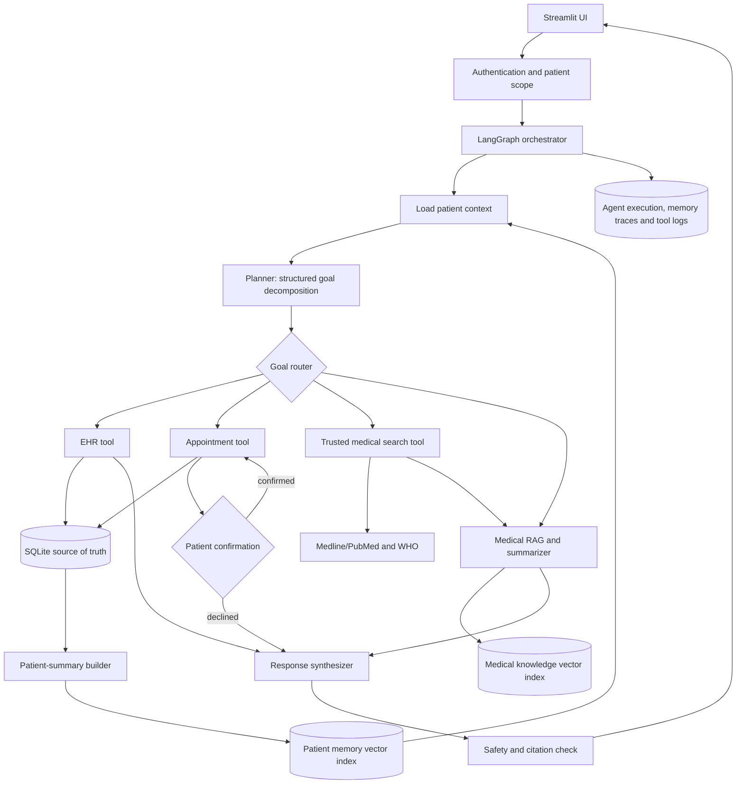

# Agentic Healthcare Assistant - Solution Design

## 1. Design objective

Implement the BRD workflow as a controlled agentic system that can:

1. interpret a multi-intent patient request;
2. retrieve authorized patient context;
3. decompose the request into ordered, typed sub-goals;
4. call only the tools allowed for each sub-goal;
5. require confirmation before booking or changing clinical data;
6. retrieve current medical information from trusted sources;
7. synthesize one answer with appointment status, medical information, and citations;
8. retain a privacy-safe summary for future conversations.

This is an administrative and informational assistant, not a diagnostic or emergency-care system.

## 2. Logical architecture



## 3. Data ownership

| Data | System of record | Vector indexed? | Notes |
|---|---|---:|---|
| Patient demographics | SQLite `patients` | No | Retrieved by exact patient ID |
| Diagnoses and treatment history | SQLite `medical_history` | Summary only | Never treat vector results as canonical records |
| Prescriptions | SQLite `prescriptions` | Summary only | Include active medication context where authorized |
| Doctors and appointments | SQLite `doctors`, `appointments` | No | Transactional queries require exact filters |
| Patient longitudinal summary | Derived from SQLite | Yes, patient-scoped | Rebuild after relevant EHR changes |
| Medical literature | External trusted sources/local corpus | Yes | Separate collection/index from patient memory |
| Conversation state | LangGraph state/checkpointer | Selectively | Do not persist raw sensitive conversation by default |
| Tool and agent events | SQLite `agent_events` | No | Store inputs in redacted form |

Use separate vector collections (or separate FAISS indexes) for `patient_memory` and `medical_knowledge`. Every patient-memory item must include `patient_id`, `summary_version`, `source_updated_at`, and `content_type` metadata, and retrieval must always filter by the authenticated patient ID.

## 4. Runtime flow

### 4.1 Request intake and planning

1. Authenticate the user and establish `actor_id`, `role`, and permitted `patient_id`.
2. Normalize the request and identify missing facts such as patient identity, preferred date, location, or consent.
3. Load structured patient facts from SQLite and retrieve relevant patient-summary chunks from the patient-memory index.
4. Send the query plus a minimal authorized context package to the planner.
5. Require the planner to return validated JSON rather than free text.

Suggested plan contract:

```json
{
  "request_id": "uuid",
  "patient_id": "patient-123",
  "needs_clarification": false,
  "goals": [
    {
      "id": "g1",
      "type": "retrieve_history",
      "depends_on": [],
      "tool": "ehr.get_patient_summary",
      "arguments": {"patient_id": "patient-123"},
      "requires_confirmation": false
    },
    {
      "id": "g2",
      "type": "find_appointment",
      "depends_on": ["g1"],
      "tool": "appointments.find_slots",
      "arguments": {"specialty": "nephrology"},
      "requires_confirmation": false
    },
    {
      "id": "g3",
      "type": "book_appointment",
      "depends_on": ["g2"],
      "tool": "appointments.book",
      "arguments": {},
      "requires_confirmation": true
    },
    {
      "id": "g4",
      "type": "medical_research",
      "depends_on": ["g1"],
      "tool": "medical_search.search",
      "arguments": {"topic": "chronic kidney disease treatments"},
      "requires_confirmation": false
    },
    {
      "id": "g5",
      "type": "synthesize_response",
      "depends_on": ["g1", "g3", "g4"],
      "tool": "response.synthesize",
      "arguments": {},
      "requires_confirmation": false
    }
  ]
}
```

The application validates the goal type, tool name, dependencies, arguments, and patient scope before execution. The model cannot invent an executable tool.

### 4.2 Goal execution

Use a LangGraph state machine with these nodes:

```text
START
  -> authenticate_and_scope
  -> load_context
  -> create_plan
  -> validate_plan
  -> execute_ready_goals
       -> retrieve_history
       -> find_slots
       -> search_medical_sources
       -> summarize_sources
  -> request_confirmation (only for booking/EHR writes)
  -> execute_confirmed_action
  -> refresh_patient_summary (only after EHR change)
  -> safety_and_grounding_check
  -> synthesize_response
  -> persist_execution_trace
  -> END
```

Independent read-only goals may run concurrently. Goals that write data remain sequential and idempotent. Store an `idempotency_key` with appointment requests so retries cannot create duplicate bookings.

### 4.3 Sample BRD scenario

For: "My 70-year-old father has chronic kidney disease. Book a nephrologist and summarize the latest treatments."

1. Resolve whether the authenticated user is allowed to access the father's record. If the patient cannot be identified or access is not authorized, ask for the missing information; do not retrieve records.
2. Query SQLite for demographics, diagnoses, active prescriptions, and recent appointments.
3. Retrieve only that patient's relevant longitudinal summary from patient memory.
4. Search doctors by normalized specialty `Nephrology`, then return matching open slots.
5. Search trusted medical sources and pass their content and metadata to the medical RAG summarizer.
6. Ask the user to select and confirm a slot.
7. Book the selected slot transactionally and return a confirmation ID.
8. Synthesize a response that clearly separates patient-specific facts, general medical information, and the completed administrative action.

## 5. Tool design

All tools should accept and return typed objects. Tools, not prompts, enforce authorization and database constraints.

### Appointment tool

- `find_doctors(specialty, location=None)`
- `find_slots(doctor_id, date_range)`
- `book(patient_id, doctor_id, slot, reason, idempotency_key)`
- `cancel(appointment_id, patient_id)`
- For this capstone, adapt the existing SQLite doctor and appointment methods behind this interface. A later Doctor Schedule API adapter can implement the same interface.
- Add a unique constraint for active doctor/date-time bookings and use a transaction to prevent race conditions.

### EHR tool backed by SQLite

- `get_patient_profile(patient_id, actor)`
- `get_patient_history(patient_id, actor)`
- `get_active_prescriptions(patient_id, actor)`
- `add_history_entry(patient_id, entry, actor, confirmation_token)`
- `update_history_entry(history_id, patch, actor, confirmation_token)`
- Add repository methods to `SQLiteStore`; avoid direct SQL scattered through agent classes.

### Medical search tool

- `search(query, source_allowlist, date_range=None)`
- Prefer Medline/PubMed and WHO or another approved authoritative source.
- Return title, source, publication/update date, URL, excerpt, and retrieval timestamp.
- Do not describe a result as "latest" unless dates were checked. If live search is unavailable, state the corpus cutoff.

### Memory tool

- `retrieve_patient_context(patient_id, query, k)`
- `rebuild_patient_summary(patient_id)`
- `append_interaction_summary(patient_id, summary)` only when retention is allowed
- Treat vector memory as recall assistance, then verify clinical facts against SQLite before presenting them.

## 6. Prompt chain

Keep prompts in `src/llm/prompt_templates.py` and version them.

1. **Context-selection prompt**: reduce retrieved facts to the minimum relevant context; never infer missing clinical facts.
2. **Planning prompt**: return only the plan schema, allowed tools, dependencies, missing information, and confirmation requirements.
3. **Medical-query formulation prompt**: convert the user intent and relevant condition into a source-search query without exposing unnecessary patient identifiers.
4. **Evidence summarization prompt**: summarize only supplied evidence, attach source references to claims, expose uncertainty, and avoid diagnosis or personalized treatment directives.
5. **Action proposal prompt**: present available appointment choices; it cannot claim a booking succeeded.
6. **Action execution**: deterministic application code invokes the booking/EHR tool after explicit confirmation.
7. **Response synthesis prompt**: combine verified tool outputs and evidence into sections for patient context, appointment result, general medical information, cautions, and sources.
8. **Safety/grounding check**: reject unsupported claims, distinguish general information from patient-specific facts, and show emergency guidance when relevant.

Prompt inputs should be structured blocks such as `USER_QUERY`, `AUTH_SCOPE`, `VERIFIED_EHR_FACTS`, `MEMORY_SNIPPETS`, `TOOL_RESULTS`, and `MEDICAL_EVIDENCE`. Never concatenate unrestricted tool output into system instructions.

## 7. LangGraph state

```python
class HealthcareState(TypedDict):
    request_id: str
    actor: dict
    patient_id: str | None
    query: str
    ehr_context: dict
    memory_context: list[dict]
    plan: dict
    completed_goal_ids: list[str]
    tool_results: dict[str, object]
    pending_confirmation: dict | None
    evidence: list[dict]
    final_response: str | None
    errors: list[dict]
```

Checkpoint state by `request_id`, not only by chat session. Do not place secrets, raw credentials, or unrestricted patient records in graph state.

## 8. Proposed repository mapping

```text
src/
  agents/
    planner.py                 # LLM/structured planner and plan validation
    executor.py                # Executes dependency-ready goals
    memory.py                  # PatientMemory service
  tools/
    appointment_tool.py        # SQLite adapter now; API adapter later
    medical_record_tool.py     # SQLite EHR operations
    medical_search_tool.py     # Medline/PubMed/WHO client
  repositories/
    ehr_repository.py          # All structured SQLite access
    agent_event_repository.py
  llm/
    prompt_templates.py
    schemas.py                 # Pydantic plan/tool-output schemas
  chains/
    patient_summary_chain.py
    medical_research_chain.py
    response_chain.py
  graphs/
    workflow_graph.py          # Full orchestration graph
    state.py
  safety/
    policy.py
    grounding.py
```

The existing `src/agents/goal_execution.py` can be gradually reduced to an orchestration/application service after its SQL is moved into repositories and tools.

## 9. Current-state gap analysis

| Requirement | Current state | Required change |
|---|---|---|
| Multi-step planner | Keyword routing returns only one goal | Structured multi-goal planner, dependency validation, clarification support |
| Appointment booking | SQLite UI flow exists | Wrap as agent tools, add confirmation, idempotency, and transactional uniqueness |
| Medical history | Schema exists | Add repository/tool CRUD, authorization, audit trail, and summary refresh |
| Disease search | Local FAISS RAG only | Add trusted external search adapter and dated/cited evidence |
| Long-term patient memory | Vector-store wrappers exist | Add patient-scoped summary creation, metadata filtering, refresh/version policy |
| Prompt engineering | General prompts are inline | Add task-specific, versioned templates and structured outputs |
| Task chaining | Simple retrieve/generate/refine graph | Replace with stateful conditional graph covering all goal types |
| Observability | Not implemented | Persist goal/tool traces, latency, outcome, and redacted errors |

## 10. Implementation sequence

### Phase 1 - deterministic domain layer

1. Extend `SQLiteStore` through repositories for history, prescriptions, appointments, and audit events.
2. Add authorization checks and password hashing; existing plain comparison must not be used beyond demo data.
3. Add booking uniqueness/idempotency and comprehensive database tests.
4. Implement typed appointment and EHR tools.

### Phase 2 - planner and workflow

1. Define Pydantic schemas for goals, plans, tool inputs, and outputs.
2. Implement the structured planner with a deterministic fallback for common intents.
3. Build the LangGraph state machine, confirmation interrupt, retries, and partial-failure handling.
4. Show the validated plan and tool outcomes in Streamlit.

### Phase 3 - memory and medical RAG

1. Build patient summaries from verified SQLite data.
2. Store them in a dedicated patient-memory index with strict patient metadata filters.
3. Add trusted medical search and a separate medical-knowledge index.
4. Add citation-aware summarization and grounding checks.

### Phase 4 - evaluation and UI

1. Add test scenarios for single-goal, multi-goal, clarification, denied access, declined confirmation, unavailable slots, duplicate booking, and search failure.
2. Measure plan validity, tool-selection accuracy, booking success, grounded-claim rate, citation coverage, latency, and failures per tool.
3. Add patient/doctor dashboards, appointment tracking, plan traces, and redacted audit logs.

## 11. Minimum acceptance scenario

The capstone scenario passes only when the system:

- generates at least the history, appointment, research, and synthesis goals;
- respects goal dependencies;
- reads the correct authorized patient's SQLite history;
- proposes a real available nephrology slot;
- does not book before explicit confirmation;
- prevents duplicate slot booking;
- produces a treatment summary grounded in dated trusted sources;
- separates general information from individualized medical advice;
- records a redacted trace of every goal and tool outcome;
- retrieves the updated patient summary in a later session.
